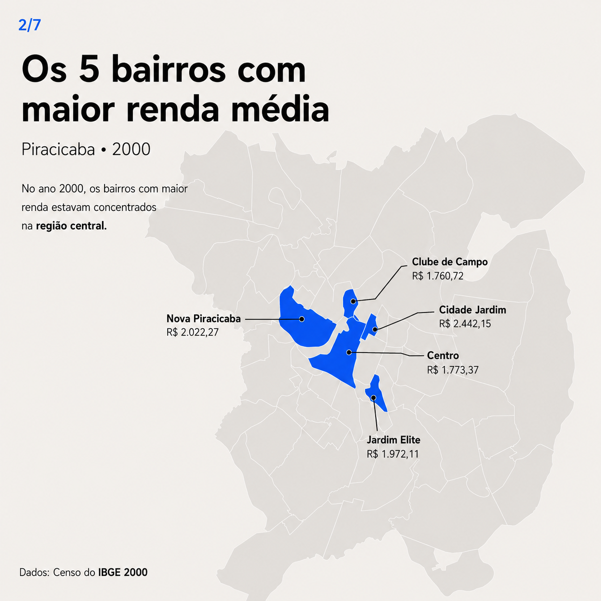
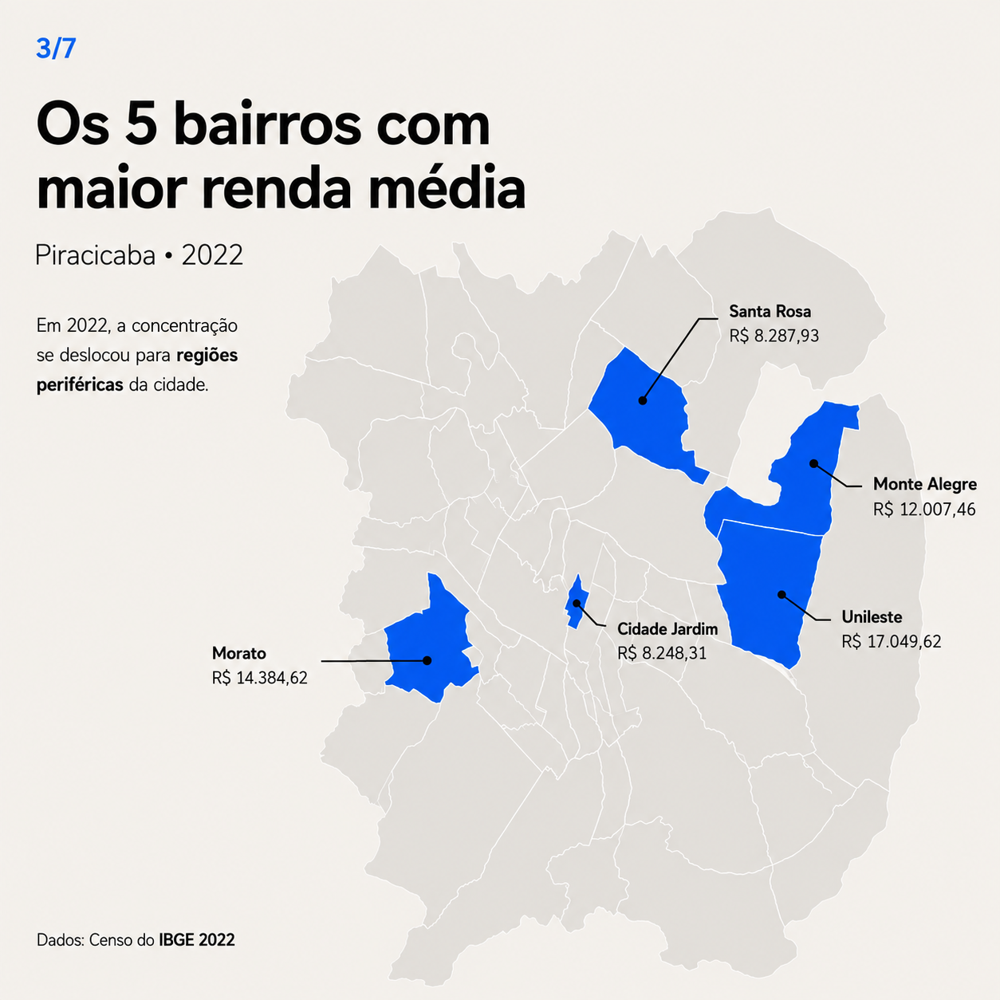
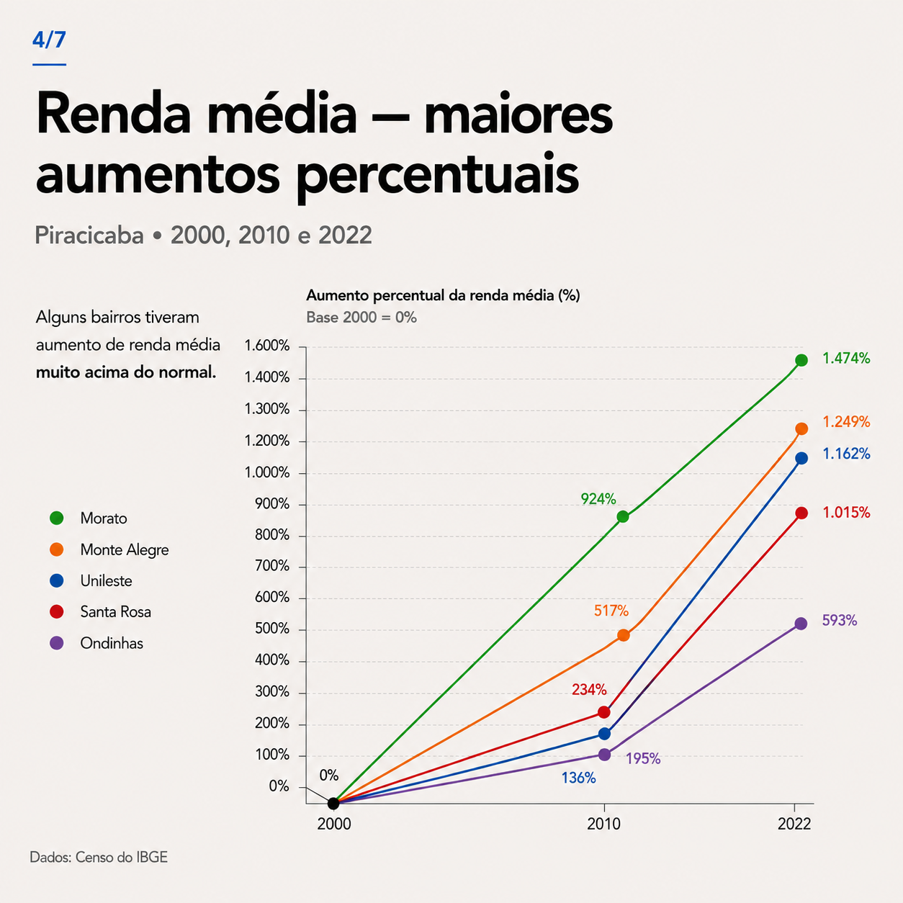
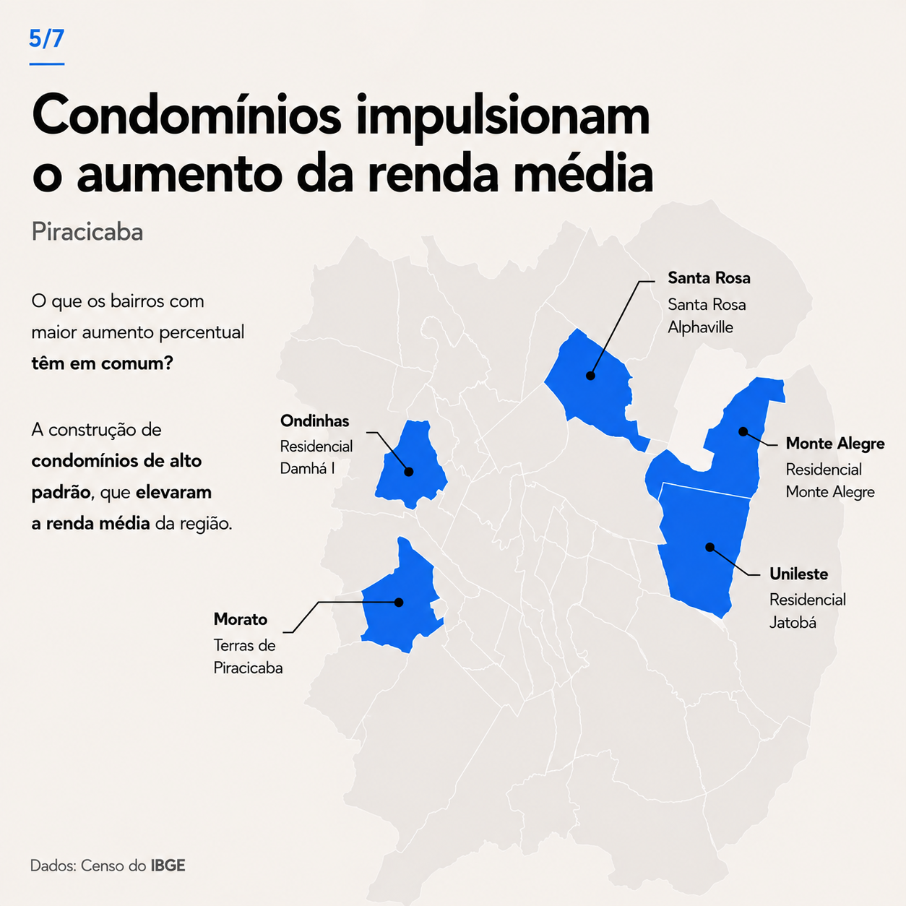
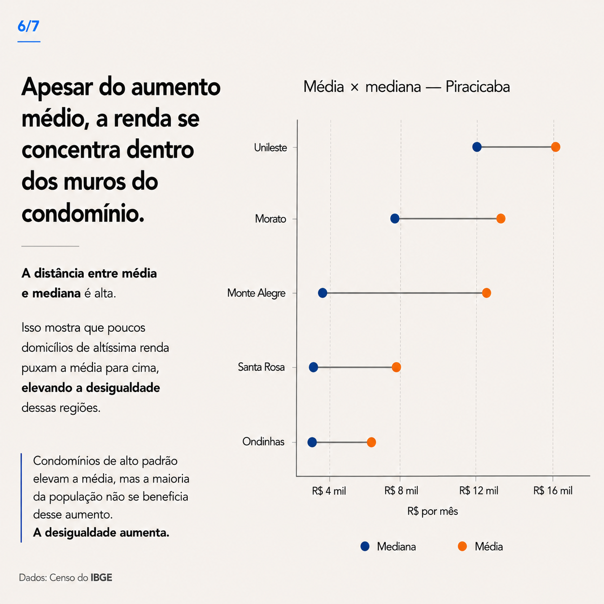
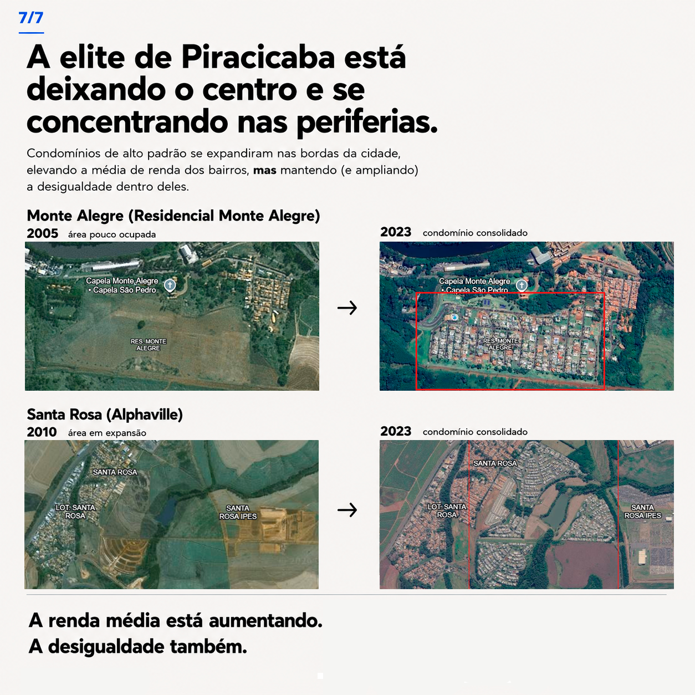

# Distribuição de Renda em Piracicaba — 2000, 2010 e 2022

> **Projeto de análise de dados socioespaciais sobre a distribuição da renda por bairro em Piracicaba (SP), com foco na transformação do mapa socioeconômico da cidade e na expansão de áreas residenciais de alto padrão.**

## 1. Sobre o projeto

Este projeto investiga como a distribuição territorial da renda em Piracicaba mudou entre os **Censos Demográficos de 2000, 2010 e 2022**.

A pergunta central foi:

> **Para onde foi a renda de Piracicaba nas últimas duas décadas?**

A análise combina:

- dados de rendimento dos Censos do **IBGE**;
- agregação de dados de setores censitários para 2010;
- reconstrução da renda média de 2000 a partir de classes de rendimento;
- média e mediana de 2022;
- análise espacial por bairro;
- arquivos geográficos em **KML**;
- imagens de satélite utilizadas apenas como evidência visual da transformação do uso do solo;
- Python, Excel e visualização cartográfica.

O objetivo não é apenas mostrar quais bairros são mais ricos, mas entender **como a concentração territorial da renda mudou ao longo do tempo**.

---

## 2. Principais resultados

### 2.1 Mudança do centro para áreas periféricas

Em **2000**, os bairros com maiores rendas médias estavam concentrados principalmente na região central.

Em **2022**, o ranking passou a ser dominado por bairros mais periféricos, como:

| Ranking | Bairro | Renda média 2022 |
|---:|---|---:|
| 1 | Unileste | R$ 17.049,62 |
| 2 | Morato | R$ 14.384,62 |
| 3 | Monte Alegre | R$ 12.007,46 |
| 4 | Santa Rosa | R$ 8.287,93 |
| 5 | Cidade Jardim | R$ 8.248,31 |

Os cinco maiores valores de 2022 estão disponíveis em `data/processed/top5_2022.csv`.

### 2.2 Crescimento nominal muito elevado em alguns bairros

Usando os valores nominais diretamente divulgados para cada ano, alguns bairros apresentam aumentos extremamente altos entre 2000 e 2022.

Exemplos:

- **Morato:** aproximadamente +1.474%;
- **Monte Alegre:** aproximadamente +1.249%;
- **Unileste:** aproximadamente +1.162%;
- **Santa Rosa:** aproximadamente +1.015%;
- **Ondinhas:** aproximadamente +593%.

**Atenção:** esses percentuais são **nominais**. Eles incorporam a inflação acumulada no período e, portanto, não devem ser interpretados isoladamente como crescimento real do poder de compra.

---

## 3. Um ponto importante sobre a inflação

Para comparar renda entre 2000, 2010 e 2022, é necessário distinguir:

### Renda nominal

É o valor registrado no próprio ano do Censo.

Exemplo:

```text
R$ 2.022 em 2000
R$ 6.602 em 2010
R$ 8.008 em 2022
```

Esses valores não estão na mesma unidade de poder de compra.

### Renda em valores de 2022

Para uma comparação econômica mais adequada, o valor histórico pode ser atualizado pelo IPCA:

```text
Renda_2022 = Renda_ano × Fator_IPCA
```

Neste projeto, a versão analítica utiliza índices médios anuais e calcula:

```text
Fator 2000 → 2022 = IPCA médio de 2022 / IPCA médio de 2000
Fator 2010 → 2022 = IPCA médio de 2022 / IPCA médio de 2010
```

Os fatores utilizados na versão reproduzível estão em:

`data/processed/ipca_base_2022.csv`

### Importante sobre a planilha original

A planilha utilizada na construção inicial do projeto contém um fator `3,393` na coluna **Conversão** do Censo 2000.

Esse fator foi utilizado na planilha original para uma conversão monetária, mas **não deve ser apresentado automaticamente como "fator oficial do IPCA 2000→2022" sem documentar a origem e a data-base**.

Por isso, para a comparação temporal reproduzível, o projeto separa:

1. valores nominais utilizados nos gráficos históricos;
2. valores corrigidos para R$ de 2022;
3. crescimento nominal;
4. crescimento real.

A metodologia oficial do IBGE explica que sua Calculadora do IPCA atualiza valores usando a razão entre os números-índice dos períodos escolhidos.

---

## 4. Como a renda de 2000 foi calculada?

O Censo 2000 apresenta a quantidade de responsáveis pelo domicílio em **classes de rendimento**, e não uma renda média diretamente comparável em nível de bairro.

Por isso foi feita uma **estimativa por ponto médio de cada classe**.

### Classes utilizadas

| Classe | Valor representativo utilizado |
|---|---:|
| Até 1/2 salário mínimo | R$ 37,50 |
| Mais de 1/2 a 1 salário | R$ 113,25 |
| Mais de 1 a 2 salários | R$ 226,50 |
| Mais de 2 a 3 salários | R$ 377,50 |
| Mais de 3 a 5 salários | R$ 604,00 |
| Mais de 5 a 10 salários | R$ 1.132,50 |
| Mais de 10 a 15 salários | R$ 1.887,50 |
| Mais de 15 a 20 salários | R$ 2.642,50 |
| Mais de 20 salários | R$ 3.775,00 |

A fórmula é:

```text
Renda média estimada =
Σ(contagem da classe × valor representativo da classe)
-------------------------------------------------------
                 total de responsáveis
```

### Por que existem valores como R$ 37,50 e R$ 113,25?

O salário mínimo utilizado como referência em 2000 era **R$ 151,00 a partir de abril de 2000**.

Fonte legal: Lei nº 9.971/2000 / Medida Provisória nº 2.019/2000.

Para as classes abertas, foi necessário adotar um valor representativo.

Por exemplo:

```text
Até 1/2 salário
→ aproximadamente 1/4 do salário mínimo
→ R$ 37,50

Mais de 1/2 a 1 salário
→ ponto médio de aproximadamente 0,75 SM
→ R$ 113,25

Mais de 20 salários
→ foi adotado 25 SM
→ 25 × R$ 151 = R$ 3.775
```

### Limitação

Essa não é uma média observada diretamente: é uma **estimativa baseada em pontos médios**.

A maior incerteza está na classe aberta:

> **Mais de 20 salários mínimos**

Por isso, os resultados de 2000 devem ser interpretados como **estimativas da renda média**, e não como valores exatos observados para cada bairro.

---

## 5. Como a renda de 2010 foi calculada?

O Censo 2010 foi trabalhado em nível de **setor censitário**.

Para cada setor foram utilizados:

- bairro;
- código do setor;
- rendimento total;
- número de responsáveis;
- classes de rendimento.

Os setores foram então agregados por bairro.

A renda média do bairro foi calculada como:

```text
Renda média do bairro =
Σ rendimento dos setores
-----------------------
Σ responsáveis dos setores
```

No arquivo utilizado, isso corresponde à estrutura:

```text
SOMA  = rendimento total agregado
TOTAL = total de responsáveis
MÉDIA = SOMA / TOTAL
```

### Por que não fazer simplesmente a média das médias dos setores?

Porque setores possuem tamanhos diferentes.

Uma média simples daria o mesmo peso a um setor com 50 responsáveis e a outro com 500.

Por isso foi utilizada uma **média ponderada pelo número de responsáveis**:

```text
Média ponderada =
Σ(média_setor × responsáveis_setor)
-------------------------------
Σ responsáveis_setor
```

que é equivalente a:

```text
Σ rendimento_setor / Σ responsáveis_setor
```

---

## 6. Como a renda de 2022 foi obtida?

O Censo 2022 disponibiliza diretamente variáveis de rendimento do responsável pelo domicílio.

Foram utilizadas principalmente:

- `V06004` — valor do rendimento nominal médio mensal;
- `V06006` — valor do rendimento nominal mediano mensal;
- `V06001` — pessoas responsáveis;
- `V06002` — moradores.

A documentação do IBGE define `V06004` como o valor do rendimento nominal médio mensal das pessoas responsáveis com rendimentos e `V06006` como o rendimento nominal mediano.

Assim, para 2022:

```text
Renda média = V06004
Renda mediana = V06006
```

---

## 7. Média x mediana

Uma das análises centrais do projeto foi comparar:

```text
Média
vs.
Mediana
```

A média pode ser puxada para cima por poucos domicílios de renda muito elevada.

A mediana representa melhor o ponto central da distribuição:

> metade dos responsáveis está abaixo dela e metade acima.

### Exemplo — 2022

| Bairro | Média | Mediana | Diferença |
|---|---:|---:|---:|
| Unileste | R$ 17.049,62 | R$ 12.500 | R$ 4.549,62 |
| Morato | R$ 14.384,62 | R$ 11.000 | R$ 3.384,62 |
| Monte Alegre | R$ 12.007,46 | R$ 4.500 | R$ 7.507,46 |
| Santa Rosa | R$ 8.287,93 | R$ 3.500 | R$ 4.787,93 |
| Cidade Jardim | R$ 8.248,31 | R$ 5.200 | R$ 3.048,31 |

O caso de **Monte Alegre** é especialmente expressivo:

```text
Média / Mediana ≈ 2,67
```

Ou seja, a média é cerca de 2,7 vezes a mediana.

Isso sugere uma distribuição bastante assimétrica e é compatível com a hipótese de concentração de domicílios de renda muito alta dentro de determinados recortes territoriais.

**Importante:** média maior que mediana indica assimetria positiva, mas não permite, sozinha, identificar quais domicílios causam essa diferença.

---

## 8. Análise espacial

Os bairros foram associados a geometrias espaciais em formato **KML**.

O arquivo contém:

- nome do bairro;
- código do bairro;
- renda 2000;
- renda 2010;
- renda 2022;
- variações entre períodos;
- geometria dos bairros.

Arquivo:

`data/source/Piracicaba_bairros_renda_2000_2010_2022.kml`

O KML pode ser aberto no Google Earth ou em softwares GIS.

---

## 9. Condomínios e transformação do território

Uma segunda camada da análise foi feita a partir de imagens de satélite para observar mudanças no uso do solo.

Foram destacados, entre outros:

- **Monte Alegre / Residencial Monte Alegre**;
- **Santa Rosa / Alphaville**;
- **Morato / Terras de Piracicaba**;
- **Unileste / Residencial Jatobá**;
- **Ondinhas / Residencial Damha**.

As imagens mostram a transformação física de áreas que apresentavam baixa ocupação ou uso predominantemente rural para áreas com maior concentração de empreendimentos residenciais.

### Interpretação

A combinação entre:

1. aumento da renda média;
2. localização periférica;
3. expansão de empreendimentos residenciais;
4. aumento da diferença entre média e mediana;

sugere uma **associação entre expansão imobiliária de alto padrão e transformação da distribuição territorial da renda**.

### Limitação causal

Este projeto **não identifica causalidade econométrica**.

Ou seja, os dados não permitem afirmar isoladamente:

> "o condomínio causou o aumento da renda".

O que a análise mostra é uma **relação espacial e temporal consistente com essa hipótese**.

Uma análise causal exigiria, por exemplo:

- dados de lançamento e ocupação dos empreendimentos;
- preço dos imóveis;
- composição socioeconômica dos novos moradores;
- controles para emprego, infraestrutura e valorização imobiliária;
- desenho de diferença-em-diferenças ou estudo de evento.

---

## 10. Estrutura da análise

```text
                 CENSO 2000
                     │
       Classes de rendimento
                     │
            Pontos médios
                     │
              Renda média
                     │
                     ▼
                 CENSO 2010
                     │
             Setores censitários
                     │
         Agregação por bairro
                     │
              Renda média
                     │
                     ▼
                 CENSO 2022
                     │
           Média + mediana
                     │
                     ▼
          ┌──────────────────┐
          │ Análise temporal │
          └──────────────────┘
                     │
          ┌──────────┴──────────┐
          ▼                     ▼
   Crescimento nominal    Correção pelo IPCA
          │                     │
          └──────────┬──────────┘
                     ▼
            Análise espacial
                     │
                     ▼
       Mapas + KML + satélite
```

---

## 11. Códigos

### `src/method_2000.py`

Reconstrói a renda média estimada de 2000 usando os pontos médios das classes de rendimento.

### `src/prepare_data.py`

Padroniza as tabelas do Excel e gera as bases analíticas.

### `src/analysis.py`

Calcula:

- crescimento nominal;
- correção monetária para R$ de 2022;
- crescimento real;
- diferença média − mediana;
- razão média/mediana.

### Executar

```bash
pip install -r requirements.txt

python src/prepare_data.py
python src/method_2000.py
python src/analysis.py
```

---

## 12. Estrutura do repositório

```text
.
├── README.md
├── SOURCES.md
├── requirements.txt
├── .gitignore
│
├── data/
│   ├── source/
│   │   ├── Compilado.xlsx
│   │   └── Piracicaba_bairros_renda_2000_2010_2022.kml
│   │
│   └── processed/
│       ├── renda_bairros.csv
│       ├── renda_2022.csv
│       ├── renda_2000_recalculada.csv
│       ├── top5_2022.csv
│       └── ipca_base_2022.csv
│
├── docs/
│   └── images/
│       ├── 01.png
│       ├── 02.png
│       ├── 03.png
│       ├── 04.png
│       ├── 05.png
│       ├── 06.png
│       └── 07.png
│
└── src/
    ├── prepare_data.py
    ├── method_2000.py
    └── analysis.py
```

---

## 13. Visualizações

### Evolução territorial






### Crescimento da renda



### Condomínios e transformação espacial



### Média x mediana



### Síntese



---

## 14. Principais conclusões

### 1. O mapa de renda mudou

A concentração dos maiores rendimentos deixou de estar exclusivamente associada ao centro e passou a aparecer também em áreas periféricas.

### 2. Alguns bairros tiveram crescimento nominal extraordinário

Morato, Monte Alegre, Unileste, Santa Rosa e Ondinhas estão entre os maiores aumentos nominais observados.

### 3. O crescimento não ocorreu de forma homogênea

Enquanto alguns bairros tiveram forte valorização da renda média, outros permaneceram relativamente estáveis.

### 4. A média esconde parte da distribuição

Em determinados bairros, a distância entre média e mediana é muito grande, indicando forte assimetria na distribuição dos rendimentos.

### 5. A expansão de condomínios aparece junto à transformação socioespacial

Os bairros que passaram por forte expansão de empreendimentos residenciais de alto padrão também aparecem entre aqueles que tiveram grandes mudanças na renda média.

### 6. Renda maior não significa necessariamente distribuição mais igualitária

O aumento da média pode ocorrer simultaneamente ao aumento da concentração de renda dentro do próprio bairro.

---

## 15. Limitações

Este estudo possui algumas limitações importantes:

- a renda de 2000 é **estimada a partir de classes de rendimento**;
- classes abertas exigem uma hipótese para o valor representativo;
- os conceitos e universos de rendimento variam entre os censos;
- 2010 foi reconstruído a partir de setores censitários;
- 2022 possui média e mediana diretamente disponíveis;
- diferenças metodológicas dos censos limitam comparações perfeitas;
- crescimento nominal não equivale a crescimento real;
- a análise de condomínios é espacial e descritiva, não causal;
- imagens de satélite são utilizadas como evidência visual da transformação territorial.

---

## 16. Fontes

### IBGE

- Censo Demográfico 2000
- Censo Demográfico 2010
- Censo Demográfico 2022
- SIDRA
- IPCA
- Base territorial e setores censitários

### Outras fontes

- legislação do salário mínimo;
- imagens de satélite utilizadas na análise espacial.

Veja `SOURCES.md` para a relação completa de links e referências.

---

## 17. Autor

**Gabriel Delvaje**  
Data Analyst

Projeto desenvolvido como estudo independente de **Data Analytics + Geospatial Analysis + Data Storytelling**, utilizando dados públicos para investigar a transformação socioeconômica de Piracicaba.

---

## Licença

Os dados estatísticos utilizados são provenientes de fontes públicas.  
Consulte as condições de uso de cada fonte antes de redistribuir dados brutos ou imagens de terceiros.
